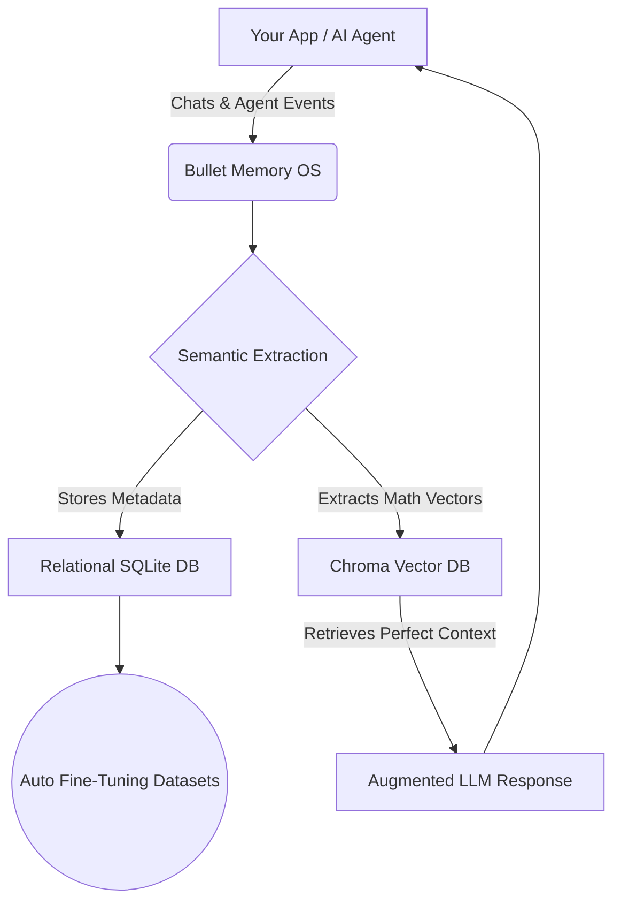

<div align="center">
  <h1>⚡ Bullet Memory OS</h1>
  <p><b>A persistent, semantic Memory OS for LLM Agents</b></p>
  <p><i>Extracts high-signal facts, deduplicates context via vector search, and auto-generates fine-tuning datasets while your agents run.</i></p>
</div>

---

## What is Bullet Memory?

Traditional LLMs have amnesia—every prompt starts from zero. 

**Bullet Memory** is a lightweight, production-grade **Memory OS** for your agents. It sits between your application and your LLM, acting as a persistent brain. It doesn't just store chat logs; it automatically extracts, deduplicates, and permanently remembers high-signal *knowledge* (facts, skills, preferences, and agent observations).

As your agents run, Bullet Memory simultaneously formats this extracted knowledge into a continuous **auto-generated JSONL fine-tuning dataset**, ready to train your custom models.

### System Architecture



---

## 🌟 Core Features

* **Agentic Memory**: Let your agents build their own long-term context across multiple sessions.
* **Semantic Search**: Understands the *meaning* of memories via ChromaDB to retrieve exactly what the LLM needs at that exact moment.
* **Continuous Fine-Tuning**: Every memory created can be instantly exported into an OpenAI-formatted JSONL dataset via the UI or API.
* **Lightning Fast**: Designed for local inference and async I/O using FastAPI and SQLAlchemy Async.
* **Integrated OS Dashboard**: A beautifully designed Streamlit interface to monitor the vector vault, manually ingest documents, and interact with a demo chatbot.

---

## 🚀 Quick Start

The easiest way to run the entire stack (FastAPI Backend, ChromaDB, and Streamlit UI) is via Docker Compose.

### 1. Configure
```bash
git clone https://github.com/Sudhanwa-git/Bullet-Memory.git
cd Bullet-Memory
cp .env.example .env
```
*(Optionally edit `.env` to point to a specific LLM provider or local Ollama instance)*

### 2. Run the OS
```bash
docker-compose up --build
```

### 3. Access
* **Memory OS UI (Streamlit)**: `http://localhost:8501`
* **API Documentation**: `http://localhost:8000/docs`

---

## 💻 Developer API

You can use the built-in Streamlit UI to visualize the system, but Bullet Memory is designed to be the headless backend for *your* agents.

### Example: Storing an Agent Event

```http
POST /ingest/event
Content-Type: application/json

{
  "user_id": "alice",
  "agent_id": "research-agent-01",
  "event_type": "observation",
  "content": "Alice prefers Python over JavaScript for backend tasks.",
  "importance": 0.95
}
```

### Example: Memory-Augmented Chat Generation

```http
POST /chat
Content-Type: application/json

{
  "user_id": "alice",
  "message": "Write a quick script for my backend."
}
```
*The engine intercepts this, fetches the semantic memory about Alice preferring Python, injects it into the system prompt, and responds with Python code.*

---

## 📂 Where is my Data?

Your data belongs to you, stored entirely locally.

* **`app/data/bullet_memory.db`**: The structured relational database tracking metadata, sources, and access counts.
* **`chroma_db/`**: The local vector store for semantic similarity search.
* **Dataset Export**: Hit the `/export` endpoint or use the UI tab to download your `JSONL` fine-tuning dataset at any time.

---

## 🛠️ Tech Stack

* **FastAPI** (Async REST API framework)
* **ChromaDB** (Vector Database)
* **SQLAlchemy & aiosqlite** (Async ORM & Relational Persistence)
* **Streamlit** (Memory OS Dashboard UI)
* **Pydantic V2** (Data Validation)

---

<div align="center">
  <i>Stop prompting from scratch. Start building agents with a past.</i>
</div>
