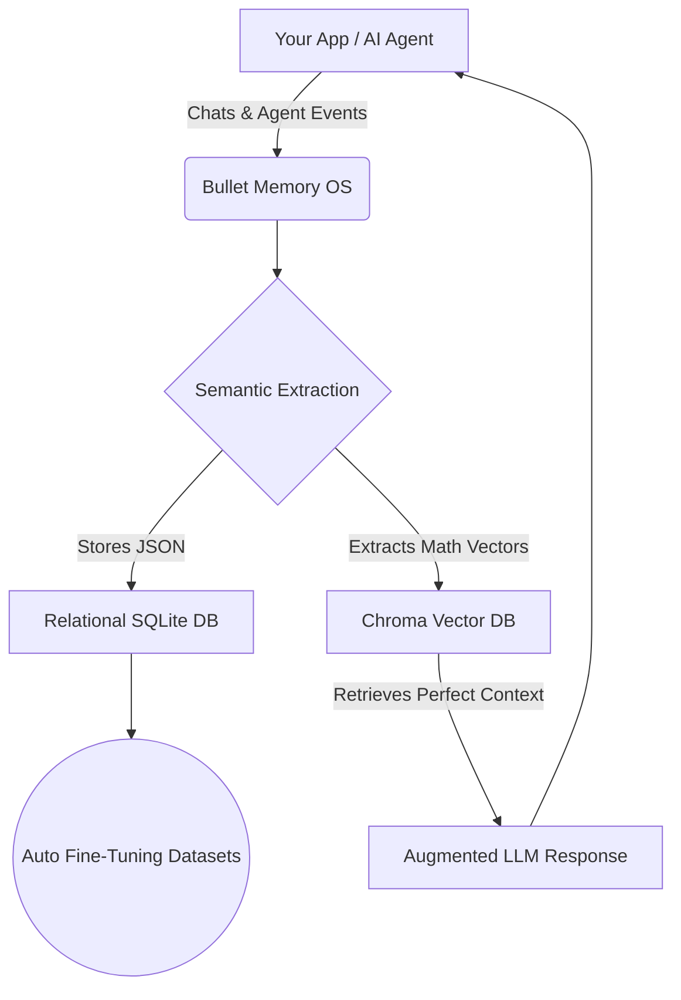

<div align="center">
  <h1>BULLET MEMORY</h1>
  <p><b>The Agentic Memory OS. Build AI that remembers, learns, and dynamically fine-tunes itself.</b></p>
</div>

---

##  What is Bullet Memory?

Traditional LLMs have amnesia—every prompt starts from zero. 

**Bullet Memory** is a lightweight, production-grade **Memory OS** for your agents. It sits between your application and your LLM, acting as a persistent brain. It doesn't just store chat logs; it extracts, deduplicates, and permanently remembers high-signal *knowledge* (facts, skills, preferences, and agent observations).

As your agents run, Bullet Memory simultaneously streams this extracted knowledge into a continuous **auto-generated fine-tuning dataset** straight to your local disk.

### The Magic SYSTEM DESIGN-:



---

## Why Use It?

* **Agentic Memory**: Let your agents build their own long-term context across multiple sessions.
* **Semantic Search**: It doesn't just keyword match; it understands the *meaning* of the memories to retrieve exactly what the LLM needs at that exact moment.
* **Continuous Fine-Tuning**: Literally an OS that produces training data. Every memory created is automatically appended to a ready-to-train JSONL dataset on your machine.
* **Lightning Fast**: Designed for local inference using optimizations like concurrent Ollama batch processing.

---

## Quick Start

### 1. Install

```bash
pip install -e ".[dev]"
```

### 2. Configure

```bash
cp .env.example .env
# Set your keys or point it to your local Ollama instance!
```

### 3. Run the OS

```bash
uvicorn app.main:app --reload
```

> **UI Dashboard:** `http://localhost:8000`  
> **API Docs:** `http://localhost:8000/docs`

---

##  Integrating With Your Agents

You can use the built-in UI to chat with it, but Bullet Memory is designed to be the backend for *your* agents.

### Example: Storing an Agent Event

```http
POST /ingest/event
Content-Type: application/json

{
  "user_id": "alice",
  "agent_id": "research-agent-01",
  "event_type": "observation",
  "content": "Alice prefers Python over JavaScript for backend tasks.",
  "importance": 0.95
}
```

### Example: Memory-Augmented Chat Generation

```http
POST /chat
Content-Type: application/json

{
  "user_id": "alice",
  "message": "Write a quick script for my backend."
}
```
*The engine will intercept this, invisibly fetch the memory about Alice preferring Python, inject it into the prompt, and respond with Python code.*

---

##  Where is my Data?

Your data belongs to you, stored entirely locally.

* **`bullet_memory_v5.db`**: The structured relational database. Viewable with any standard SQLite browser.
* **`chroma_db_v5/`**: The local vector store for semantic similarity.
* **`datasets/`**: The goldmine. The auto-generated JSONL files containing your OpenAI-formatted fine-tuning datasets, continuously updated in the background.

---

##  Built With

* **FastAPI** for blazing fast endpoints.
* **ChromaDB** for local vector embeddings.
* **SQLAlchemy** (Async SQLite) for structured relational persistence.
* **Ollama & OpenAI** adapters included out-of-the-box.

---

**Bullet Memory** — Stop prompting from scratch. Start building agents with a past.
